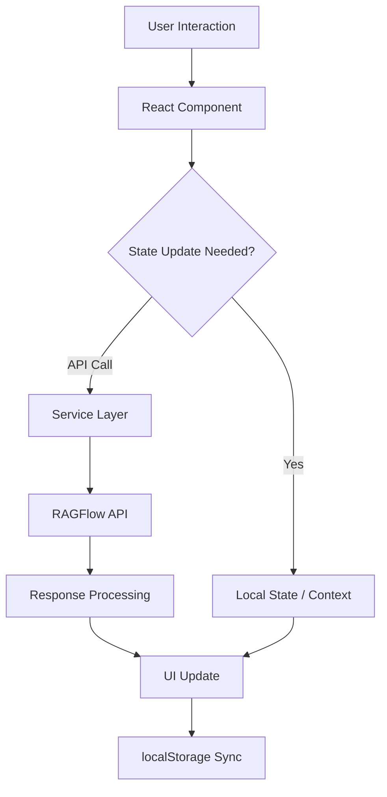

# 🏗️ 시스템 아키텍처 문서

## 📋 개요

HanaNav AI Chat Frontend는 RAGFlow 기반의 지능형 대화 시스템으로, React/TypeScript를 사용한 모던 웹 애플리케이션입니다.

## 🎯 핵심 아키텍처 원칙

### 1. 컴포넌트 기반 설계
- **재사용 가능한 UI 컴포넌트**: Atomic Design 패턴 적용
- **Props 기반 통신**: 명확한 데이터 흐름
- **합성을 통한 확장성**: Higher-Order Components 활용

### 2. 상태 관리 전략
- **React State**: 컴포넌트 로컬 상태
- **localStorage**: 세션 영속성 및 설정 저장
- **Context API**: 전역 상태 관리 (테마, 사용자 설정)

### 3. 타입 안정성
- **엄격한 TypeScript**: strict mode 활성화
- **인터페이스 기반 설계**: API 응답 타입 정의
- **제네릭 활용**: 재사용 가능한 유틸리티 함수

## 🔄 데이터 플로우



## 🧱 컴포넌트 아키텍처

### 컴포넌트 계층 구조
```
App
├── AppShell
│   ├── Navigation
│   └── ThemeProvider
├── Router
│   ├── HomePage
│   ├── ChatPage
│   │   ├── ChatHeader
│   │   ├── ChatMessages
│   │   │   └── ChatBubble[]
│   │   ├── ChatInput
│   │   └── KnowledgeBaseSelector
│   ├── AdminConsole
│   │   ├── EvaluationPanel
│   │   └── SystemSettings
│   └── KnowledgeBase
└── GlobalModals
```

### 컴포넌트 분류

#### 1. Atoms (원자 컴포넌트)
```typescript
// 최소 단위의 UI 컴포넌트
export interface ButtonProps {
  variant: 'primary' | 'secondary' | 'outline';
  size: 'sm' | 'md' | 'lg';
  children: React.ReactNode;
  onClick?: () => void;
}

// 예시: Button, Icon, Input, Badge
```

#### 2. Molecules (분자 컴포넌트)
```typescript
// Atoms를 조합한 기능 단위 컴포넌트
export interface SearchBarProps {
  placeholder: string;
  onSearch: (query: string) => void;
  onFilter?: (filters: FilterOption[]) => void;
}

// 예시: SearchBar, MessageInput, AssistantSelector
```

#### 3. Organisms (유기체 컴포넌트)
```typescript
// 복잡한 기능을 수행하는 큰 단위 컴포넌트
export interface ChatInterfaceProps {
  sessionId: string;
  assistantId: string;
  initialMessages?: Message[];
}

// 예시: ChatInterface, EvaluationPanel, KnowledgeBaseManager
```

#### 4. Templates & Pages
```typescript
// 레이아웃과 페이지 구성
export interface ChatPageProps {
  session: ChatSession;
  onSessionChange: (session: ChatSession) => void;
}

// 예시: ChatPage, AdminConsole, HomePage
```

## 🔌 서비스 레이어 아키텍처

### API 서비스 구조
```typescript
// 기본 API 클라이언트
class ApiClient {
  private baseURL: string;
  private apiKey: string;

  async request<T>(
    endpoint: string,
    options: RequestOptions
  ): Promise<ApiResponse<T>> {
    // 공통 요청 로직
  }
}

// RAGFlow 서비스
class RAGFlowService extends ApiClient {
  async createSession(params: CreateSessionParams): Promise<Session> {}
  async sendMessage(sessionId: string, message: Message): Promise<Response> {}
  async uploadFiles(datasetId: string, files: File[]): Promise<Document[]> {}
}

// Ollama 평가 서비스
class OllamaService extends ApiClient {
  async evaluate(request: EvaluationRequest): Promise<EvaluationResult> {}
  async batchEvaluate(requests: EvaluationRequest[]): Promise<EvaluationResult[]> {}
}
```

### 서비스 추상화
```typescript
// 인터페이스 기반 설계로 확장성 확보
interface ChatService {
  createSession(params: CreateSessionParams): Promise<Session>;
  sendMessage(sessionId: string, message: string): Promise<MessageResponse>;
  getSessionHistory(sessionId: string): Promise<Message[]>;
}

interface EvaluationService {
  evaluate(request: EvaluationRequest): Promise<EvaluationResult>;
  getSupportedMetrics(): Promise<string[]>;
}
```

## 🔄 상태 관리 패턴

### 1. 로컬 상태 (useState)
```typescript
// 컴포넌트 내부 상태
const [isLoading, setIsLoading] = useState(false);
const [messages, setMessages] = useState<Message[]>([]);
const [inputValue, setInputValue] = useState('');
```

### 2. 세션 영속성 (localStorage)
```typescript
// 세션 데이터 영속화
const saveSession = (sessionId: string, data: SessionData) => {
  localStorage.setItem(`hana_session_${sessionId}`, JSON.stringify(data));
};

const loadSession = (sessionId: string): SessionData | null => {
  const data = localStorage.getItem(`hana_session_${sessionId}`);
  return data ? JSON.parse(data) : null;
};
```

### 3. 전역 상태 (Context)
```typescript
// 테마 및 사용자 설정
interface AppContextType {
  theme: 'light' | 'dark' | 'system';
  setTheme: (theme: 'light' | 'dark' | 'system') => void;
  user: User | null;
  apiConfig: ApiConfig;
}

const AppContext = createContext<AppContextType>();

export const useAppContext = () => {
  const context = useContext(AppContext);
  if (!context) {
    throw new Error('useAppContext must be used within AppProvider');
  }
  return context;
};
```

## 🔐 보안 아키텍처

### 1. API 키 관리
```typescript
// 환경변수를 통한 민감 정보 관리
const API_CONFIG = {
  ragflowUrl: import.meta.env.VITE_RAGFLOW_API_URL,
  ragflowKey: import.meta.env.VITE_RAGFLOW_API_KEY,
} as const;

// 클라이언트 사이드에서 API 키 노출 최소화
class SecureApiClient {
  private headers = {
    'Authorization': `Bearer ${API_CONFIG.ragflowKey}`,
    'Content-Type': 'application/json'
  };
}
```

### 2. 데이터 검증
```typescript
// Zod를 활용한 런타임 타입 검증
import { z } from 'zod';

const MessageSchema = z.object({
  id: z.string(),
  content: z.string(),
  role: z.enum(['user', 'assistant', 'system']),
  timestamp: z.string().datetime(),
  sources: z.array(z.object({
    id: z.string(),
    title: z.string(),
    content: z.string()
  })).optional()
});

type Message = z.infer<typeof MessageSchema>;
```

### 3. XSS 방지
```typescript
// ReactMarkdown을 통한 안전한 마크다운 렌더링
<ReactMarkdown
  components={{
    a: ({ href, children, ...props }) => (
      <a
        href={href}
        target="_blank"
        rel="noopener noreferrer"
        {...props}
      >
        {children}
      </a>
    )
  }}
>
  {content}
</ReactMarkdown>
```

## 🎨 UI 아키텍처

### 1. 디자인 시스템
```typescript
// Design Tokens
export const tokens = {
  colors: {
    primary: {
      50: '#eff6ff',
      500: '#3b82f6',
      900: '#1e3a8a'
    },
    semantic: {
      success: '#10b981',
      warning: '#f59e0b',
      error: '#ef4444',
      info: '#3b82f6'
    }
  },
  typography: {
    fontFamily: {
      sans: ['Inter', 'system-ui', 'sans-serif'],
      mono: ['JetBrains Mono', 'monospace']
    },
    fontSize: {
      xs: '0.75rem',
      sm: '0.875rem',
      base: '1rem',
      lg: '1.125rem',
      xl: '1.25rem'
    }
  },
  spacing: {
    0: '0',
    1: '0.25rem',
    2: '0.5rem',
    3: '0.75rem',
    4: '1rem'
  }
} as const;
```

### 2. 컴포넌트 변형 시스템 (CVA)
```typescript
import { cva, type VariantProps } from 'class-variance-authority';

const buttonVariants = cva(
  // 기본 클래스
  "inline-flex items-center justify-center rounded-md text-sm font-medium transition-colors focus-visible:outline-none disabled:pointer-events-none disabled:opacity-50",
  {
    variants: {
      variant: {
        default: "bg-primary text-primary-foreground hover:bg-primary/90",
        destructive: "bg-destructive text-destructive-foreground hover:bg-destructive/90",
        outline: "border border-input bg-background hover:bg-accent",
        secondary: "bg-secondary text-secondary-foreground hover:bg-secondary/80",
        ghost: "hover:bg-accent hover:text-accent-foreground",
        link: "text-primary underline-offset-4 hover:underline"
      },
      size: {
        default: "h-10 px-4 py-2",
        sm: "h-9 rounded-md px-3",
        lg: "h-11 rounded-md px-8",
        icon: "h-10 w-10"
      }
    },
    defaultVariants: {
      variant: "default",
      size: "default"
    }
  }
);

export interface ButtonProps
  extends React.ButtonHTMLAttributes<HTMLButtonElement>,
    VariantProps<typeof buttonVariants> {
  asChild?: boolean;
}
```

### 3. 반응형 디자인 전략
```typescript
// 브레이크포인트 기반 반응형 컴포넌트
const ResponsiveLayout = () => {
  return (
    <div className="
      grid
      grid-cols-1
      md:grid-cols-2
      lg:grid-cols-3
      gap-4
      p-4
      md:p-6
      lg:p-8
    ">
      {/* 모바일: 1열, 태블릿: 2열, 데스크톱: 3열 */}
    </div>
  );
};

// 조건부 렌더링
const AdaptiveNavigation = () => {
  const [isMobile, setIsMobile] = useState(false);

  useEffect(() => {
    const checkScreenSize = () => {
      setIsMobile(window.innerWidth < 768);
    };

    checkScreenSize();
    window.addEventListener('resize', checkScreenSize);
    return () => window.removeEventListener('resize', checkScreenSize);
  }, []);

  return isMobile ? <MobileNavigation /> : <DesktopNavigation />;
};
```

## 🚀 성능 최적화 전략

### 1. 코드 분할 (Code Splitting)
```typescript
// 라우트 기반 코드 분할
const ChatPage = lazy(() => import('./components/ChatPage'));
const AdminConsole = lazy(() => import('./components/AdminConsole'));

// 컴포넌트 기반 코드 분할
const EvaluationPanel = lazy(() =>
  import('./components/EvaluationPanel').then(module => ({
    default: module.EvaluationPanel
  }))
);
```

### 2. 메모이제이션
```typescript
// React.memo로 불필요한 리렌더링 방지
const ChatBubble = React.memo<ChatBubbleProps>(({
  message,
  onSourceClick
}) => {
  return (
    <div className="chat-bubble">
      {/* 컴포넌트 내용 */}
    </div>
  );
}, (prevProps, nextProps) => {
  // 커스텀 비교 함수
  return prevProps.message.id === nextProps.message.id;
});

// useMemo로 비싼 계산 캐싱
const processedMessages = useMemo(() => {
  return messages.map(message => ({
    ...message,
    formattedTime: formatTimestamp(message.timestamp),
    wordCount: message.content.split(' ').length
  }));
}, [messages]);

// useCallback으로 함수 참조 안정화
const handleSendMessage = useCallback((content: string) => {
  const newMessage = {
    id: generateId(),
    content,
    role: 'user',
    timestamp: new Date().toISOString()
  };
  setMessages(prev => [...prev, newMessage]);
}, []);
```

### 3. 가상화 (Virtualization)
```typescript
// 긴 메시지 목록의 가상화
import { FixedSizeList as List } from 'react-window';

const VirtualizedMessageList = ({ messages }: { messages: Message[] }) => {
  const Row = ({ index, style }: { index: number; style: React.CSSProperties }) => (
    <div style={style}>
      <ChatBubble message={messages[index]} />
    </div>
  );

  return (
    <List
      height={600}
      itemCount={messages.length}
      itemSize={100}
      overscanCount={5}
    >
      {Row}
    </List>
  );
};
```

## 🔄 이벤트 시스템

### 1. 커스텀 훅을 통한 이벤트 관리
```typescript
// 실시간 메시지 스트리밍
const useMessageStream = (sessionId: string) => {
  const [stream, setStream] = useState<ReadableStream | null>(null);
  const [isStreaming, setIsStreaming] = useState(false);

  const startStream = useCallback(async (message: string) => {
    setIsStreaming(true);

    try {
      const response = await sendStreamingMessage(sessionId, message);
      const reader = response.body?.getReader();

      if (reader) {
        while (true) {
          const { done, value } = await reader.read();
          if (done) break;

          const chunk = new TextDecoder().decode(value);
          // 스트림 데이터 처리
          onStreamData(chunk);
        }
      }
    } finally {
      setIsStreaming(false);
    }
  }, [sessionId]);

  return { startStream, isStreaming };
};
```

### 2. 전역 이벤트 시스템
```typescript
// 이벤트 에미터 패턴
class EventBus {
  private events: Map<string, Function[]> = new Map();

  on(event: string, callback: Function) {
    if (!this.events.has(event)) {
      this.events.set(event, []);
    }
    this.events.get(event)?.push(callback);
  }

  emit(event: string, data?: any) {
    const callbacks = this.events.get(event);
    callbacks?.forEach(callback => callback(data));
  }

  off(event: string, callback: Function) {
    const callbacks = this.events.get(event);
    if (callbacks) {
      const index = callbacks.indexOf(callback);
      if (index > -1) {
        callbacks.splice(index, 1);
      }
    }
  }
}

export const eventBus = new EventBus();

// 사용 예시
eventBus.on('message:received', (message) => {
  console.log('새 메시지:', message);
});

eventBus.emit('message:received', newMessage);
```

## 📊 모니터링 및 로깅

### 1. 에러 경계 (Error Boundary)
```typescript
class ErrorBoundary extends React.Component<
  React.PropsWithChildren<{}>,
  { hasError: boolean; error?: Error }
> {
  constructor(props: React.PropsWithChildren<{}>) {
    super(props);
    this.state = { hasError: false };
  }

  static getDerivedStateFromError(error: Error) {
    return { hasError: true, error };
  }

  componentDidCatch(error: Error, errorInfo: React.ErrorInfo) {
    console.error('Error caught by boundary:', error, errorInfo);

    // 에러 리포팅 서비스로 전송
    reportError(error, errorInfo);
  }

  render() {
    if (this.state.hasError) {
      return (
        <div className="error-fallback">
          <h2>문제가 발생했습니다</h2>
          <p>페이지를 새로고침해 주세요.</p>
          <button onClick={() => window.location.reload()}>
            새로고침
          </button>
        </div>
      );
    }

    return this.props.children;
  }
}
```

### 2. 성능 메트릭
```typescript
// 커스텀 성능 측정 훅
const usePerformanceMetrics = (componentName: string) => {
  useEffect(() => {
    const startTime = performance.now();

    return () => {
      const endTime = performance.now();
      const duration = endTime - startTime;

      console.log(`${componentName} 렌더링 시간: ${duration}ms`);

      // 성능 데이터 수집
      if (duration > 100) {
        console.warn(`${componentName} 렌더링이 느립니다: ${duration}ms`);
      }
    };
  }, [componentName]);
};
```

## 🔮 확장성 고려사항

### 1. 플러그인 시스템
```typescript
// 플러그인 인터페이스
interface ChatPlugin {
  name: string;
  version: string;
  initialize: (context: ChatContext) => void;
  onMessage: (message: Message) => Message | void;
  onResponse: (response: Response) => Response | void;
  cleanup: () => void;
}

// 플러그인 매니저
class PluginManager {
  private plugins: Map<string, ChatPlugin> = new Map();

  register(plugin: ChatPlugin) {
    this.plugins.set(plugin.name, plugin);
    plugin.initialize(this.context);
  }

  executeHook(hookName: keyof ChatPlugin, data: any) {
    for (const plugin of this.plugins.values()) {
      const hook = plugin[hookName];
      if (typeof hook === 'function') {
        const result = hook(data);
        if (result) data = result;
      }
    }
    return data;
  }
}
```

### 2. 마이크로 프론트엔드 대비
```typescript
// 모듈 연합 (Module Federation) 준비
const ModularComponent = React.lazy(() => {
  return import('remoteApp/Component').catch(() => {
    // 폴백 컴포넌트 반환
    return import('./FallbackComponent');
  });
});

// 동적 import를 통한 기능 모듈 로딩
const loadFeatureModule = async (moduleName: string) => {
  try {
    const module = await import(`./features/${moduleName}/index.ts`);
    return module.default;
  } catch (error) {
    console.error(`Failed to load module: ${moduleName}`, error);
    return null;
  }
};
```

---

이 아키텍처 문서는 HanaNav AI Chat Frontend의 기술적 구조와 설계 원칙을 상세히 설명합니다. 시스템의 확장성과 유지보수성을 보장하며, 새로운 개발자들이 프로젝트를 이해하고 기여할 수 있도록 돕습니다.