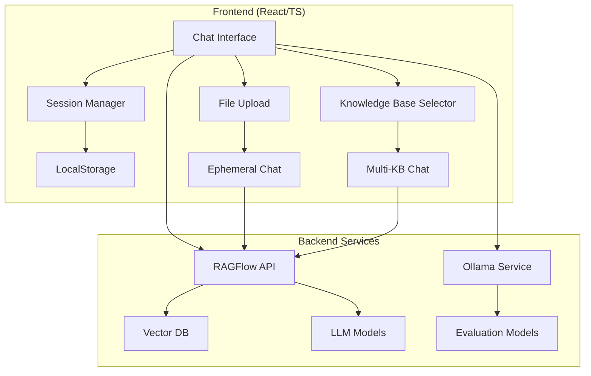

# 🤖 HanaNav AI Chat Frontend

> **고성능 AI 채팅 프론트엔드** - RAGFlow 기반 지능형 대화 시스템

[](https://reactjs.org/)
[](https://www.typescriptlang.org/)
[](https://vitejs.dev/)
[](https://tailwindcss.com/)

## 미리보기
[✨ 버셀에서 바로 확인하기](https://web-hana-nav-front-dev.vercel.app/)

## 📋 목차

- [✨ 주요 기능](#-주요-기능)
- [🏗️ 시스템 아키텍처](#️-시스템-아키텍처)
- [🚀 빠른 시작](#-빠른-시작)
- [💡 사용 예시](#-사용-예시)
- [🔧 설정 및 환경변수](#-설정-및-환경변수)
- [📚 API 연동](#-api-연동)
- [🎨 UI/UX 특징](#-uiux-특징)
- [🔍 품질 평가 시스템](#-품질-평가-시스템)
- [📦 프로젝트 구조](#-프로젝트-구조)
- [🛠️ 개발 가이드](#️-개발-가이드)

## ✨ 주요 기능

### 🎯 멀티 어시스턴트 시스템
- **빠른 응답 모드**: 신속한 일반 질문 처리
- **정밀 검증 모드**: 상세한 분석과 근거 제시
- **요약 모드**: 긴 문서의 핵심 내용 요약

### 🧠 지능형 대화 관리
- **동적 프롬프팅**: 상황에 맞는 자동 프롬프트 전환
- **컨텍스트 보존**: 대화 흐름과 참조 자료 유지
- **세션 복원**: 브라우저 재시작 후에도 대화 이력 복구

### 📁 파일 기반 채팅
- **드래그 앤 드롭**: 직관적인 파일 업로드
- **격리된 채팅**: 업로드된 파일만을 기반으로 한 순수 대화
- **벡터 DB 생성**: 실시간 문서 임베딩 및 검색

### 📚 지식베이스 연동
- **다중 KB 선택**: 여러 지식베이스 동시 활용
- **실시간 전환**: 일상대화 ↔ RAG 모드 자동 전환
- **출처 추적**: 답변의 근거 자료 명시

### 📊 품질 평가 시스템
- **Ollama 통합**: 로컬 LLM 기반 자동 평가
- **4가지 지표**: 정확도, 관련성, 가독성, 개인정보 보호
- **배치 처리**: 대량 데이터 일괄 평가

### 🎨 고급 UI/UX
- **반응형 디자인**: 모바일/태블릿/데스크톱 최적화
- **다크모드 지원**: 자동/수동 테마 전환
- **마이크로 인터렉션**: Framer Motion 기반 애니메이션
- **접근성**: ARIA 표준 준수, 키보드 내비게이션

## 🏗️ 시스템 아키텍처



## 🚀 빠른 시작

### 요구사항
- **Node.js**: 20 LTS 이상
- **npm**: 10 이상
- **RAGFlow Backend**: API 서버 운영 중
- **Ollama**: 평가 시스템용 (선택사항)

### 설치 및 실행

```bash
# 저장소 클론
git clone [repository-url]
cd web-hanaNav-front

# 의존성 설치
npm ci

# 환경설정 파일 생성
cp .env.example .env.local

# 개발 서버 시작
npm run dev
```

### 프로덕션 빌드
```bash
npm run build
npm run preview
```

## 💡 사용 예시

### 1️⃣ 일반 채팅
```typescript
// 빠른 응답 모드로 일상대화
사용자: "안녕하세요! 오늘 날씨가 어때요?"
AI: "안녕하세요! 죄송하지만 실시간 날씨 정보는..."
```

### 2️⃣ 지식베이스 활용
```typescript
// 금융 규정 KB 연결 후
사용자: "대출 한도는 어떻게 계산하나요?"
AI: "대출 한도는 다음과 같이 계산됩니다..."
[근거: 은행업감독규정 제XX조]
```

### 3️⃣ 파일 기반 채팅
```typescript
// PDF 파일 업로드 후
사용자: "이 계약서의 주요 조건을 요약해주세요"
AI: "업로드하신 계약서의 주요 조건은..."
[출처: 업로드된 계약서 3페이지]
```

### 4️⃣ 평가 시스템 활용
```typescript
// 관리자 콘솔에서
const evaluation = await evaluateWithOllama({
  question: "대출 금리는?",
  answer: "현재 대출 금리는 3.5%입니다",
  required_facts: [{ text: "금리 3.5%", must: true }]
}, 'accuracy');

console.log(evaluation.score); // 0.85
```

## 🔧 설정 및 환경변수

```bash
# .env.local 파일 설정
VITE_RAGFLOW_API_URL=http://localhost:9380      # RAGFlow API 주소
VITE_RAGFLOW_API_KEY=your_api_key_here          # RAGFlow API 키

# 개발 서버 설정 (선택사항)
DEV_SERVER_HOST=localhost
DEV_SERVER_PORT=18080
DEV_ALLOWED_HOSTS=localhost,127.0.0.1

# HMR 설정 (선택사항)
DEV_HMR_HOST=localhost
DEV_HMR_PORT=18081
```

## 📚 API 연동

### RAGFlow API
```typescript
// 채팅 세션 생성
const session = await createSession({
  name: "새 대화",
  assistantId: "quick-response-assistant"
});

// 메시지 전송
const response = await sendMessage(sessionId, {
  message: "안녕하세요",
  stream: true
});
```

### Ollama 평가 API
```typescript
// 평가 요청
const result = await evaluateWithOllama({
  question_id: "q001",
  question: "대출 조건은?",
  answer: "소득증명서가 필요합니다",
  required_facts: [
    { text: "소득증명서", must: true }
  ]
}, 'accuracy');
```

## 🎨 UI/UX 특징

### 컴포넌트 시스템
- **Radix UI**: 접근성 우선 헤드리스 컴포넌트
- **Tailwind CSS**: 유틸리티 퍼스트 스타일링
- **CVA**: 조건부 스타일 변형 관리
- **Framer Motion**: 부드러운 애니메이션

### 디자인 토큰
```scss
// Motion Tokens
--motion-duration-fast: 150ms;
--motion-duration-normal: 300ms;
--motion-duration-slow: 500ms;

// Typography Scale
--font-size-xs: 0.75rem;
--font-size-sm: 0.875rem;
--font-size-base: 1rem;
--font-size-lg: 1.125rem;
```

### 반응형 브레이크포인트
```scss
sm: 640px    // Mobile landscape
md: 768px    // Tablet
lg: 1024px   // Desktop
xl: 1280px   // Large desktop
2xl: 1536px  // Extra large
```

## 🔍 품질 평가 시스템

### 평가 지표

1. **정확도 (Accuracy)**
   - 문서 매칭: 30%
   - 사실 정확성: 50%
   - 환각 방지: 20%

2. **관련성 (Relevance)**
   - 의도 부합도: 50%
   - 주제 적합성: 50%

3. **가독성 (Readability)**
   - 간결성: 50%
   - 중복 제거: 50%

4. **개인정보 보호 (Privacy)**
   - 불필요한 PII 제거: 60%
   - 적절한 마스킹: 40%

### 평가 워크플로우
```typescript
// 배치 평가 실행
const results = await batchEvaluate(
  dataset,
  ['accuracy', 'relevance', 'readability', 'privacy'],
  'gemma3:12b',
  (completed, total) => {
    console.log(`진행률: ${completed}/${total}`);
  }
);
```

## 📦 프로젝트 구조

```
src/
├── components/              # React 컴포넌트
│   ├── atoms/              # 기본 UI 컴포넌트
│   │   ├── Button/
│   │   ├── Icon/
│   │   └── Input/
│   ├── animations/         # 애니메이션 컴포넌트
│   ├── icons/             # 커스텀 아이콘
│   ├── ui/                # shadcn/ui 컴포넌트
│   ├── AdminConsole.tsx   # 관리자 콘솔
│   ├── ChatPage.tsx       # 메인 채팅 인터페이스
│   ├── EvaluationPanel.tsx # 평가 시스템 UI
│   └── KnowledgeBase.tsx  # 지식베이스 관리
├── services/               # API 서비스
│   ├── ragflow.ts         # RAGFlow API 클라이언트
│   └── ollama.ts          # Ollama 평가 서비스
├── hooks/                  # React 훅
│   ├── useMotion.ts       # 모션 제어
│   └── useRipple.ts       # 리플 효과
├── styles/                 # 스타일 파일
│   ├── fonts.css          # 폰트 정의
│   └── motion-tokens.css  # 모션 토큰
└── types/                  # TypeScript 타입 정의
```

## 🛠️ 개발 가이드

### 스크립트 명령어
```bash
npm run dev          # 개발 서버 시작
npm run build        # 프로덕션 빌드
npm run preview      # 빌드 미리보기
npm run lint         # ESLint 실행
npm run lint:fix     # ESLint 자동 수정
npm run type-check   # TypeScript 타입 검사
npm run format       # Prettier 포맷팅
```

### 코드 스타일
- **ESLint**: TypeScript/React 규칙 적용
- **Prettier**: 코드 포맷팅 자동화
- **Husky**: Git 훅으로 품질 검사
- **TypeScript**: 엄격한 타입 체크

### 기여 가이드
1. 기능 브랜치 생성: `git checkout -b feature/new-feature`
2. 코드 작성 및 테스트
3. 린트 및 타입 검사: `npm run lint && npm run type-check`
4. 커밋 및 푸시
5. Pull Request 생성

## 📄 라이선스

이 프로젝트는 개발 중인 프로토타입입니다.

---

### 🔗 관련 링크
- [Figma 디자인](https://www.figma.com/design/EeO32LGPaBgtsAY7tm0sIu/High-Fidelity-Chatbot-Prototype)
- [RAGFlow 공식 문서](https://github.com/infiniflow/ragflow)
- [Ollama 모델 허브](https://ollama.ai/models)

### 👥 개발팀
- **Frontend**: React/TypeScript 기반 SPA
- **Backend**: RAGFlow API 연동
- **AI/ML**: Ollama 평가 시스템

**마지막 업데이트**: 2024년 9월 20일
